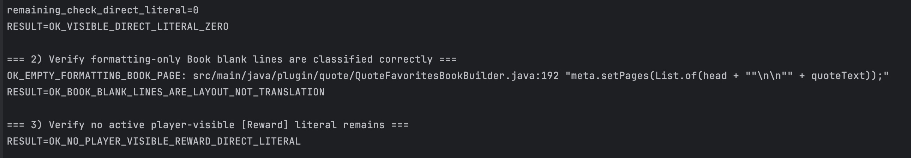
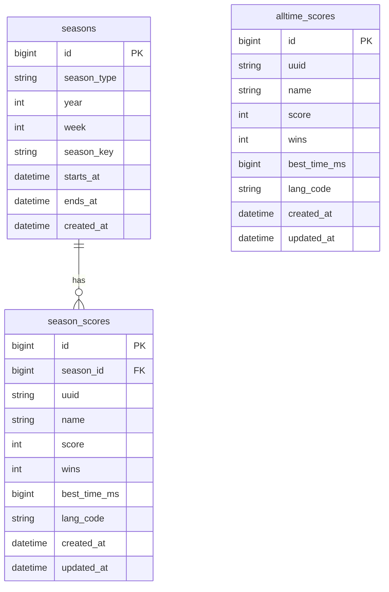

# TreasureRun — Treasure Hunt Mini-Game Plugin for Spigot 1.20.1

[](https://github.com/flowmari/TreasureRun/actions/workflows/ci.yml)
[](https://github.com/flowmari/TreasureRun/actions/workflows/i18n-ci.yml)

> **A Minecraft Spigot mini-game plugin focused on maintainable Java architecture, 19-language i18n, CI quality gates, Docker-based validation, MySQL persistence, and effect-rich gameplay.**

TreasureRun is a custom treasure-hunt mini-game plugin for Minecraft Spigot 1.20.1.  

TreasureRun separates internal game logic from player-facing display text, making the plugin easier to localize, audit, and maintain across 19 language packs.
Players search for treasure chests within a time limit, earn scores, trigger visual/audio effects, and interact with multilingual in-game UI.

This repository is designed as a portfolio project that demonstrates not only gameplay implementation, but also **engineering discipline: internationalization, quality control, runtime verification, and maintainable plugin design**.

<!-- TREASURERUN_PLATFORM_BOUNDARY_I18N_HIGHLIGHT -->

## Engineering Highlight: Platform-Boundary i18n

TreasureRun includes a hybrid Minecraft standard-message i18n architecture for Minecraft 1.20.1.

This project demonstrates **platform-boundary i18n engineering for Minecraft standard UI text**, going beyond normal plugin-owned localization.

It is structured as a **contributor-ready localization system for a global open-source project**: custom Minecraft language registration, reproducible ResourcePack assets, Fabric runtime language sync, ProtocolLib packet auditing, verification docs, and CI-backed quality gates make the system easier to inspect, reproduce, and extend.

Minecraft standard UI text cannot be fully controlled by a Spigot plugin alone.  
To work around that limitation, TreasureRun combines **Spigot / ProtocolLib / ResourcePack / Fabric Mod** into a multi-layer architecture.

### Key Technical Decisions

- **8039-key standard-message coverage**  
  Minecraft standard translation assets are aligned across both the Fabric Mod and ResourcePack layers.

- **Lightweight runtime payload**  
  The server does not send huge 20-language JSON payloads at runtime.  
  It sends only the player's selected language code, such as `ja`, `en`, `de`, or `zh_tw`.

- **Safe client-side reload path**  
  The Fabric client applies the selected language through Minecraft's own runtime resource lifecycle:
  - update the selected language
  - call Minecraft's `LanguageManager`
  - trigger `client.reloadResources()`
  - reload the bundled 8039-key language assets without restarting Minecraft

- **Avoiding fragile internal mutation**  
  TreasureRun does not directly mutate Minecraft's internal `TranslationStorage` map.  
  Instead, it asks Minecraft to rebuild translation storage through the normal resource reload lifecycle.

### 日本語要約

Minecraft標準文のi18n制約に対し、TreasureRunでは **Spigot / ProtocolLib / ResourcePack / Fabric Mod** を組み合わせた多層アーキテクチャを設計しました。

8039キーの標準翻訳資産をFabric ModとResourcePackで整列し、実行時は20言語分の巨大データを送らず、選択言語コードのみを軽量payloadとして同期します。

Fabric側では `LanguageManager` と `client.reloadResources()` を使い、内部 `TranslationStorage` を直接書き換えずに、Minecraftの通常のresource reload経路で再起動なしの言語反映を行います。

This is more than a translation feature.  
It is a systems-design solution for a real platform constraint.

<!-- TREASURERUN_REVIEWER_ENGINEERING_SIGNAL -->

### Engineering Design Summary

This part of TreasureRun focuses on more than feature implementation:

- platform constraint analysis
- multi-layer architecture design
- runtime client/server synchronization
- lightweight payload design
- CI/CD quality gates
- maintainable i18n operations

In short, the project demonstrates **platform constraints / architecture / runtime design / CI/CD / quality gates / maintainability** through a working Minecraft i18n system.

<!-- TREASURERUN_DATA_DRIVEN_LANGMAP_ARCHITECTURE -->

### Data-Driven Language Mapping

TreasureRun uses `lang-map.yml` as a single source of truth for language routing.

Earlier versions relied on Java-side `switch` logic to map TreasureRun language codes to Minecraft language asset files.  
That approach works for a small fixed set of languages, but it does not scale well because every new language would require a code change.

The current design moves that mapping into data:

- `src/main/resources/lang-map.yml`
- `fabric-i18n-mod/src/main/resources/lang-map.yml`

The Fabric client mod, validation scripts, and GitHub Actions checks all read the same mapping definition.

This means language expansion is handled as a configuration-and-assets change, not a Java control-flow change.  
When a new language is added, the intended path is:

1. add the language mapping to `lang-map.yml`
2. add the matching language assets
3. let GitHub Actions validate the ResourcePack, Fabric Mod mapping, and i18n coverage

This keeps the Minecraft i18n system maintainable as the language set grows, without adding new hardcoded Java branches for every locale.

<!-- TREASURERUN_RUNTIME_HOTSWAP_DEMO -->

## Runtime Language Hot-Swap Demo

_GIF evidence will be added after recording ._

This demo verifies the runtime language-switching flow:

- the server sends only the selected language code
- the Fabric client applies it through Minecraft's 
- the client calls 
- Minecraft standard-message language assets are reloaded without restarting the game

Evidence:

- [Runtime demo guide](docs/verification/runtime-demo/language-hot-swap-demo-guide-20260506_122416.md)
- [Server-side runtime log](docs/verification/runtime-demo/language-hot-swap-server-log-20260506_122416.txt)

<!-- TREASURERUN_QUALITY_CONTROL_NOTE -->

## Quality Control Notes

TreasureRun keeps i18n quality checks separate from build success.

Suspicious i18n findings are classified as player-visible text, internal diagnostic logs, generated legacy keys, or Minecraft standard asset text.  
This keeps CI useful without hiding real localization issues.

See: [`docs/quality/i18n-audit-noise-classification.md`](docs/quality/i18n-audit-noise-classification.md)

<!-- TREASURERUN_CICD_VERIFICATION_NOTE -->

## CI/CD Verification

TreasureRun uses GitHub Actions to protect build quality and i18n coverage.

The latest `main` workflow set passed:

- `CI`
- `i18n-check`
- `i18n-ci`
- `i18n-expansion-ci`

This verifies that the plugin build, i18n checks, and 4-layer i18n expansion guard run automatically on GitHub Actions.

Evidence: [`docs/verification/ci-cd/github-actions-main-success-20260506_090148.md`](docs/verification/ci-cd/github-actions-main-success-20260506_090148.md)

---

<!-- TREASURERUN_GAME_DESIGN_LINK -->

## Game Design Notes

TreasureRun also includes a short design note explaining how its setting, multilingual worldbuilding, and player-facing atmosphere connect to the game systems.

See [`docs/GAME_DESIGN.md`](docs/GAME_DESIGN.md) for details.

---

## Hybrid Minecraft Standard-Message i18n

TreasureRun implements a hybrid i18n architecture that combines Bukkit/Adventure, ProtocolLib, and a server-side resource pack.

### 日本語概要

TreasureRun では、Bukkit/Adventure・ProtocolLib・server-side resource pack を統合したハイブリッド i18n 基盤を実装しました。

PacketI18n で server-to-client の標準メッセージを監査・置換しつつ、resource pack 側では client lang key override を担わせることで、参加後に表示される Minecraft 標準文を多言語化する現実的な最大到達点を狙う設計に整理しています。

ResourcePack の送信、accept、load も実行ログで検証し、PacketI18n についても translate audit / replace / missing warning を数値で追跡できる状態にしました。

### Minimal PoC

This repository also documents a minimal hybrid i18n PoC for Minecraft standard messages.

The PoC combines:

- ProtocolLib packet audit / replace
- server-side resource pack delivery
- Mojang official Minecraft 1.20.1 language assets
- client language-key overrides
- runtime verification logs

See: [`docs/poc/minimal-hybrid-standard-message-i18n-poc.md`](docs/poc/minimal-hybrid-standard-message-i18n-poc.md)

### Verified architecture

- Bukkit/Adventure-based plugin message layer
- ProtocolLib PacketI18n audit / replace layer
- Mojang official Minecraft 1.20.1 language assets based server-side resource pack
- Official Minecraft 1.20.1 client-jar `en_us.json` base for English-derived pack files
- TreasureRun custom standard-message overrides
- Runtime verification for ResourcePack sent / accepted / loaded
- Runtime verification for PacketI18n translate audit / replace
- `Translation missing: 0`
- `I18n Missing key warning: 0`

### Scope

This targets the practical maximum range of Minecraft standard messages visible after server join.

It does not claim absolute control over pre-login, authentication, client settings screens, purely client-local UI, or every Minecraft engine/client string.

See: [`docs/architecture/hybrid-minecraft-standard-message-i18n.md`](docs/architecture/hybrid-minecraft-standard-message-i18n.md)
## [日本語](#japanese) | [English](#english)

---

<a id="japanese"></a>

## 日本語

### これは何？

**TreasureRun** は、Minecraft Spigot 1.20.1 向けの宝探しミニゲームプラグインです。

プレイヤーは制限時間内に宝箱を探し、スコアを獲得し、ランキングや演出付きの結果表示を体験できます。

このプロジェクトでは、単なるゲーム機能だけでなく、以下のような **実務で評価されやすい設計・品質管理** を重視しています。

- Javaコード内のユーザー向け直書き文字列を削減
- 19言語の `languages/*.yml` によるi18n管理
- 翻訳キー欠落、YAML構文、重複キーをCIで検査
- Docker上のSpigotサーバーで実行検証
- MySQLによるスコア・ログ永続化
- エフェクト、ランキング、言語設定、ゲーム進行を分離して管理

---

### 主な機能

#### ゲームプレイ

- 宝箱探索ミニゲーム
- Easy / Normal / Hard の難易度
- 制限時間つきのゲーム進行
- 宝箱回収数、タイム、スコア、ランクの表示
- 結果メッセージとゲーム内演出

#### 視覚・音響演出

- UFO caravan / Wandering Trader / Trader Llama 演出
- Moving Safety Zone
- パーティクル、サウンド、床エフェクト
- ランキング報酬演出
- 宝箱接近時の音響フィードバック

#### i18n / 多言語対応

- 19言語の `languages/*.yml`
- プレイヤーごとの言語設定
- `/lang` による言語選択
- GUI上の言語表示
- Javaコードは翻訳キーを参照し、文言はYAML側に外部化

対応言語例：

```text
ja, en, de, fr, it, sv, es, fi, nl, ru, ko, zh_tw, pt, hi, la, lzh, is, sa, asl_gloss
```

---

<!-- TREASURERUN_DOCS_SPLIT_JA_START -->
### 使い方・設計ドキュメント

README本体は概要を短く保ち、詳細な使い方・コマンド仕様・設計意図は外部ドキュメントに分離しています。

| Document | 内容 |
|---|---|
| [`docs/COMMANDS.md`](docs/COMMANDS.md) | プレイヤー向け・OP向けコマンド、権限、alias、サブコマンド |
| [`docs/ARCHITECTURE.md`](docs/ARCHITECTURE.md) | Module / Layer構成、Mermaid構成図、Tech Highlights、Runtime Flow |
| [`docs/I18N_RESOURCEPACK_ALIASING_FALLBACK.md`](docs/I18N_RESOURCEPACK_ALIASING_FALLBACK.md) | Fabric Modなし環境向けのResourcePack alias fallback設計、client language制約、Modあり/なし両対応の到達範囲 |

#### Quick Start / Local Runtime

```bash
./gradlew clean build
docker compose up -d
cp build/libs/TreasureRun-1.0-SNAPSHOT-all.jar spigot-data/plugins/
docker restart minecraft_spigot
docker logs -f minecraft_spigot
```

#### Tech Highlights

| Area | このプロジェクトで示していること |
|---|---|
| Concurrency / Scheduler | Bukkit schedulerによるゲーム進行、演出、遅延実行、cleanup |
| Security / Permissions | `plugin.yml` permissions、OP限定コマンド、debug gate |
| Performance / Runtime Safety | 生成ブロック・entity・taskのcleanup、演出のbounded execution |
| Resilience / Fallback / Reload | i18n fallback chain、JAR同梱language filesからの再生成、`/treasureReload` |

> TreasureRun は Spigot plugin であり REST API service ではないため、Swagger/OpenAPI は使わず、`docs/COMMANDS.md` と `docs/ARCHITECTURE.md` に外部化しています。

---
<!-- TREASURERUN_DOCS_SPLIT_JA_END -->

### CI品質ゲート

GitHub Actionsで以下を検証しています。

- 19言語YAMLの構文チェック
- 必須キーの存在チェック
- Javaコードから参照されるi18nキーの存在チェック
- 重複キーの検出
- Gradleビルド

これにより、翻訳キーの欠落やYAMLの構文エラーがある状態で変更が混入しにくい構成にしています。

---

### 技術スタック

| Category | Technology |
|---|---|
| Language | Java 17 |
| Game Server | Spigot 1.20.1 |
| Build | Gradle / ShadowJar |
| Database | MySQL 8 |
| Runtime Validation | Docker / Docker Compose |
| CI | GitHub Actions |
| i18n | YAML language packs |
| IDE | IntelliJ IDEA |

---

### アーキテクチャ概要

```text
TreasureRun
├── Game Core
│   ├── TreasureRunMultiChestPlugin
│   ├── GameStageManager
│   ├── TreasureChestManager
│   └── TreasureRunStartCommand
│
├── Gameplay Effects
│   ├── MovingSafetyZoneTask
│   ├── UfoCaravanController
│   ├── RankRewardManager
│   └── ChestProximitySoundService
│
├── i18n
│   ├── I18n
│   ├── LanguagesYamlStore
│   ├── LanguageSelectGui
│   └── src/main/resources/languages/*.yml
│
├── Ranking / Persistence
│   ├── RealtimeRankTicker
│   ├── SeasonRepository
│   ├── SeasonScoreRepository
│   └── MySQL
│
└── CI / Quality Gates
    ├── scripts/check_i18n_yaml_syntax.py
    ├── scripts/check_i18n_required_keys.py
    ├── scripts/check_i18n_referenced_keys.py
    └── scripts/check_i18n_duplicate_keys.py
```

---

### i18n品質検証

このプロジェクトでは、翻訳ファイルを「置いて終わり」ではなく、CIで検証しています。

代表的な検証結果：

```text
RESULT=OK_YAML_SYNTAX
RESULT=OK_REQUIRED_KEYS
RESULT=OK_REFERENCED_KEYS
RESULT=OK_DUPLICATE_KEYS
RESULT=OK_BUILD
```



サーバー側でも、古い `plugins/TreasureRun/languages` が優先されないように退避し、最新JAR同梱のlanguageファイルから再生成されることを確認しました。

```text
[Lang] copied from jar: languages/en.yml
[Lang] copied from jar: languages/ja.yml
...
[Lang] copied from jar: languages/asl_gloss.yml
```

最終的にDocker上のSpigotサーバーでも19言語が有効化されていることを確認しています。

```text
Server languages count: 19
minecraft_spigot: healthy
```

---

### ビルド方法

```bash
./gradlew clean shadowJar
```

生成されるJAR：

```text
build/libs/TreasureRun-1.0-SNAPSHOT-all.jar
```

---

### ローカル実行環境

このプロジェクトは、Docker上のSpigotサーバーで検証しています。

```bash
docker compose up -d
```

プラグインJARをサーバーへ配置し、コンテナを再起動して確認します。

```bash
docker cp build/libs/TreasureRun-1.0-SNAPSHOT-all.jar minecraft_spigot:/data/plugins/
docker restart minecraft_spigot
docker logs --tail=200 minecraft_spigot
```

---

### 技術レビュー向けの見どころ

このリポジトリでは、以下の実装力を確認できます。

- Spigot APIを使ったゲームシステム実装
- Javaでの状態管理、イベント処理、コマンド実装
- MySQL連携によるスコア永続化
- Dockerを使ったローカル実行検証
- 19言語i18nの設計と運用
- GitHub ActionsによるCI品質ゲート
- バグ修正、検証、再発防止まで含めた開発プロセス

---

<a id="english"></a>

<div lang="en" translate="no">

## English

### What is TreasureRun?

**TreasureRun** is a custom Minecraft mini-game plugin for Spigot 1.20.1.

Players search for treasure chests within a time limit, earn scores, experience visual/audio effects, and view ranking-related feedback in-game.

This project is designed not only as a playable mini-game, but also as a portfolio project demonstrating **maintainable Java plugin architecture, 19-language internationalization, CI quality gates, Docker-based runtime validation, and MySQL-backed persistence**.

---

### Project Focus

This project emphasizes engineering practices that are important in real-world software development:

- Reducing hardcoded player-facing strings in Java
- Externalizing UI/game messages into YAML language packs
- Supporting 19 language files
- Detecting missing i18n keys through CI
- Detecting YAML syntax errors before merge
- Validating the plugin on a Docker-based Spigot server
- Separating gameplay, effects, ranking, language, and persistence responsibilities

---

### Key Features

#### Gameplay

- Treasure-hunt mini-game
- Easy / Normal / Hard difficulty modes
- Time-limited game flow
- Chest collection, time, score, and rank display
- Result messages and in-game effects
- MySQL-backed weekly/monthly/all-time ranking persistence with startup-safe SQL migrations

#### Visual and Audio Effects

- UFO caravan with Wandering Trader and Trader Llamas
- Moving Safety Zone
- Particle effects, sound effects, and dynamic floor visuals
- Ranking reward effects
- Chest proximity sound feedback

#### Internationalization

- 19 YAML language packs
- Per-player language selection
- `/lang` command and language selection GUI
- Java code references i18n keys instead of hardcoded messages
- Player-facing messages are externalized into `src/main/resources/languages/*.yml`

Supported language packs include:

```text
ja, en, de, fr, it, sv, es, fi, nl, ru, ko, zh_tw, pt, hi, la, lzh, is, sa, asl_gloss
```

---

<!-- TREASURERUN_DOCS_SPLIT_EN_START -->
### Usage and Design Documentation

The README is intentionally kept as a concise project overview. Detailed usage, command behavior, and architectural design are externalized into dedicated documents.

| Document | Content |
|---|---|
| [`docs/COMMANDS.md`](docs/COMMANDS.md) | Player/admin commands, permissions, aliases, and subcommands |
| [`docs/ARCHITECTURE.md`](docs/ARCHITECTURE.md) | Module/layer structure, Mermaid architecture diagram, tech highlights, and runtime flow |
| [`docs/I18N_RESOURCEPACK_ALIASING_FALLBACK.md`](docs/I18N_RESOURCEPACK_ALIASING_FALLBACK.md) | ResourcePack alias fallback for non-Fabric clients, Minecraft client language limitations, and Fabric/non-Fabric i18n routing |

#### Quick Start / Local Runtime

```bash
./gradlew clean build
docker compose up -d
cp build/libs/TreasureRun-1.0-SNAPSHOT-all.jar spigot-data/plugins/
docker restart minecraft_spigot
docker logs -f minecraft_spigot
```

#### Tech Highlights

| Area | What this project demonstrates |
|---|---|
| Concurrency / Scheduler | Bukkit scheduler usage for gameplay flow, effects, delayed execution, and cleanup |
| Security / Permissions | `plugin.yml` permissions, operator-only commands, and debug gating |
| Performance / Runtime Safety | Cleanup of generated blocks, entities, tasks, and bounded visual/audio effects |
| Resilience / Fallback / Reload | i18n fallback chain, regeneration from bundled language files, and `/treasureReload` |

> TreasureRun is a Spigot plugin, not a REST API service. Swagger/OpenAPI is intentionally not used; command and architecture documentation are externalized instead.

---
<!-- TREASURERUN_DOCS_SPLIT_EN_END -->

### CI Quality Gates

GitHub Actions validates:

- YAML syntax across language files
- Required i18n keys
- Java-referenced i18n keys
- Duplicate YAML keys
- Gradle build

This prevents incomplete translations, broken YAML, and missing keys from entering the main branch unnoticed.

---

### Tech Stack

| Category | Technology |
|---|---|
| Language | Java 17 |
| Game Server | Spigot 1.20.1 |
| Build Tool | Gradle / ShadowJar |
| Database | MySQL 8 |
| Runtime Validation | Docker / Docker Compose |
| CI | GitHub Actions |
| i18n | YAML language packs |
| IDE | IntelliJ IDEA |

---

### Architecture Overview

```text
TreasureRun
├── Game Core
│   ├── TreasureRunMultiChestPlugin
│   ├── GameStageManager
│   ├── TreasureChestManager
│   └── TreasureRunStartCommand
│
├── Gameplay Effects
│   ├── MovingSafetyZoneTask
│   ├── UfoCaravanController
│   ├── RankRewardManager
│   └── ChestProximitySoundService
│
├── i18n
│   ├── I18n
│   ├── LanguagesYamlStore
│   ├── LanguageSelectGui
│   └── src/main/resources/languages/*.yml
│
├── Ranking / Persistence
│   ├── RealtimeRankTicker
│   ├── SeasonRepository
│   ├── SeasonScoreRepository
│   └── MySQL
│
└── CI / Quality Gates
    ├── scripts/check_i18n_yaml_syntax.py
    ├── scripts/check_i18n_required_keys.py
    ├── scripts/check_i18n_referenced_keys.py
    └── scripts/check_i18n_duplicate_keys.py
```

---

### i18n Quality Verification

The i18n system is not just a set of translation files. It is validated through CI.

Expected verification output:

```text
RESULT=OK_YAML_SYNTAX
RESULT=OK_REQUIRED_KEYS
RESULT=OK_REFERENCED_KEYS
RESULT=OK_DUPLICATE_KEYS
RESULT=OK_BUILD
```


The Docker-based Spigot runtime was also checked to ensure that old server-side language files do not override the latest bundled language files.

```text
[Lang] copied from jar: languages/en.yml
[Lang] copied from jar: languages/ja.yml
...
[Lang] copied from jar: languages/asl_gloss.yml
```

Final server-side confirmation:

```text
Server languages count: 19
minecraft_spigot: healthy
```

---

### Build

```bash
./gradlew clean shadowJar
```

Output:

```text
build/libs/TreasureRun-1.0-SNAPSHOT-all.jar
```

---

### Local Runtime Validation

The plugin is tested on a Docker-based Spigot server.

```bash
docker compose up -d
```

Deploy the plugin JAR:

```bash
docker cp build/libs/TreasureRun-1.0-SNAPSHOT-all.jar minecraft_spigot:/data/plugins/
docker restart minecraft_spigot
docker logs --tail=200 minecraft_spigot
```

---

### Why This Project Matters

TreasureRun demonstrates practical backend/plugin engineering skills beyond a simple tutorial project:

- Java plugin development with Spigot API
- Event-driven gameplay implementation
- Runtime state management
- MySQL-backed persistence
- Docker-based local verification
- 19-language i18n architecture
- CI-based quality control
- Debugging, validation, and maintainability-focused development

</div>

---

## Repository Status

- CI: passing
- i18n validation: passing
- Supported languages: 19
- Runtime server validation: confirmed with Docker-based Spigot environment

---

## License

This project is currently a personal portfolio project.

### Event-Level Localization for Engine-Generated Messages

TreasureRun localizes not only plugin-owned UI text, but also selected Minecraft/Spigot engine-generated messages through Bukkit event listeners.

Vanilla death messages are intercepted via `PlayerDeathEvent`, classified into stable i18n keys such as `gameplay.death.firework`, `gameplay.death.explosion`, and `gameplay.death.generic`, resolved against the player’s selected language, and rendered through the same YAML-based i18n pipeline used by GUI, books, chat, BossBar, ActionBar, and ranking messages.

This keeps all supported languages parallel instead of treating English as the only default source and other languages as secondary translations.

### Bukkit Event-Layer System Message Localization

TreasureRun extends its YAML-based i18n pipeline beyond plugin-owned UI text into selected Minecraft/Spigot engine-generated system messages.

The plugin intercepts Bukkit event-layer messages such as player join, quit, kick, advancement announcements, server list MOTD, unknown commands, no-permission command feedback, and death messages. Each message is resolved through the player's selected language and the same `languages/<lang>.yml` files used by GUI, books, chat, BossBar, ActionBar, rankings, and gameplay results.

For advancement announcements, TreasureRun suppresses the vanilla global announcement and rebroadcasts a localized message per online receiver. This demonstrates a dynamic localization pipeline where the same server event can be rendered differently for different players depending on their stored language preference.

Scope note: client-side, authentication, network, and pre-login errors are outside the Bukkit plugin layer, so TreasureRun describes this feature as Bukkit event-layer system message localization rather than full client/protocol localization.

#### Two-Layer i18n Architecture

TreasureRun now uses a two-layer localization strategy for player-visible messages.

1. **Bukkit event layer**
   - localizes join / quit / death / advancement-style messages where Bukkit events expose the message safely
   - uses TreasureRun's existing i18n pipeline and per-player language preference

2. **ProtocolLib packet layer**
   - intercepts server-to-client chat/system packets such as `SYSTEM_CHAT` and `CHAT`
   - audits vanilla JSON components that contain Minecraft `translate` keys
   - maps detected keys into TreasureRun YAML keys such as:

```text
minecraft.packet.multiplayer.player.joined
minecraft.packet.multiplayer.player.left
```

The first goal is not to translate every vanilla message at once.  
Instead, TreasureRun can run with `packetMessages.audit: true` and collect the actual Minecraft `translate` keys that appear in the running Spigot environment.

When a key appears in the audit log, it can be added safely to `languages/*.yml` as a TreasureRun-managed translation key. This makes the packet-level localization scope evidence-based rather than guess-based.

This demonstrates a layered i18n design:

- Bukkit event-level localization for safe, high-level events
- ProtocolLib packet-level auditing for lower-level vanilla/system messages
- YAML-backed 20-language translation expansion
- per-player language preference integration

This is intentionally designed as an extensible localization foundation rather than a one-off string replacement.

Runtime verification for the packet-level audit layer is documented here:

- [`docs/verification/packet-i18n-audit.md`](docs/verification/packet-i18n-audit.md)
- [`docs/verification/packet-i18n-scope.md`](docs/verification/packet-i18n-scope.md)
- [`docs/dev/packet-i18n-audit-commands.md`](docs/dev/packet-i18n-audit-commands.md)


#### Repository Layer

TreasureRun separates ranking persistence from the main gameplay flow into dedicated repository classes:

- `SeasonRepository`
  - resolves the current ISO weekly season
  - creates a season row if it does not exist
  - returns a stable `season_id`

- `SeasonScoreRepository`
  - writes weekly and monthly ranking data to `season_scores`
  - writes all-time ranking data to `alltime_scores`
  - updates score, win count, best clear time, and selected language code

This design keeps database persistence responsibilities separate from gameplay orchestration, making the ranking system easier to test, maintain, and extend.

In Japanese terms, the ranking persistence logic is separated from the core game flow.  
`SeasonRepository` is responsible for resolving or creating weekly and monthly seasons, while `SeasonScoreRepository` is responsible for updating weekly, monthly, and all-time ranking records.

#### Ranking Database Design



Weekly and monthly ranking rows are stored in `season_scores` and linked to `seasons` by `season_scores.season_id -> seasons.id`.

All-time ranking rows are stored independently in `alltime_scores`, because they are not tied to a specific season row.

#### Ranking Database Constraints

The ranking persistence schema is designed with production-style database constraints:

- `PRIMARY KEY`
  - `seasons.id`
  - `season_scores.id`
  - `alltime_scores.id`

- `FOREIGN KEY`
  - `season_scores.season_id -> seasons.id`
  - guarantees that weekly score records always belong to a valid season

- `UNIQUE KEY`
  - `uniq_season_type_year_week` prevents duplicate season rows for the same season identity (`season_type`, `year`, `week`, `season_key`)
  - `uniq_season_uuid` prevents duplicate weekly ranking rows for the same player and season
  - `uniq_alltime_uuid` prevents duplicate all-time ranking rows for the same player

- `NOT NULL / NULL policy`
  - required aggregate values such as `score` and `wins` use `NOT NULL` defaults
  - optional values such as `best_time_ms` and `lang_code` allow `NULL` when unavailable

- `ON DUPLICATE KEY UPDATE`
  - updates accumulated score and win count
  - keeps the best clear time by preserving the lower `best_time_ms`
  - updates the player's latest selected language code

This makes the ranking system more than simple data storage. It supports season-aware aggregation, all-time ranking accumulation, multilingual gameplay tracking, and database-level integrity.


### MySQL Ranking Persistence

TreasureRun stores weekly, monthly, and all-time ranking data in MySQL.

The ranking schema is managed through a bundled SQL migration file:

- [`src/main/resources/db/migration/V1__create_ranking_tables.sql`](src/main/resources/db/migration/V1__create_ranking_tables.sql)
- [`src/main/resources/db/migration/V2__support_monthly_seasons.sql`](src/main/resources/db/migration/V2__support_monthly_seasons.sql)
- [`docs/sql/V1__create_ranking_tables.sql`](docs/sql/V1__create_ranking_tables.sql)
- [`docs/sql/V2__support_monthly_seasons.sql`](docs/sql/V2__support_monthly_seasons.sql)

On plugin startup, TreasureRun runs an automatic migration check through `MigrationRunner`.

Applied migrations are recorded in the `schema_migrations` table, so the same migration is not executed twice after a server restart. This prevents runtime schema drift such as missing tables, missing columns, or incompatible database defaults.

Runtime verification is documented here:

- [`docs/verification/ranking-persistence.md`](docs/verification/ranking-persistence.md)

This feature demonstrates Java repository-layer persistence, MySQL schema design, weekly/monthly/all-time ranking separation, foreign key integrity, unique-key based upsert design, selected-language tracking, Docker-based runtime verification, and startup-safe database migration.

### Hybrid Minecraft i18n Architecture

TreasureRun uses a hybrid i18n architecture to maximize localization coverage across Minecraft's different text paths:

- plugin-level YAML translations for TreasureRun gameplay text,
- ProtocolLib packet-level translation for observable server packets,
- server-side resource-pack language JSON files for client-resolved Minecraft translation keys,
- automatic resource-pack delivery on player join using the committed ZIP URL and SHA1 hash.

The resource pack contains the full vanilla Minecraft 1.20.1 language-key set for the exact 20 TreasureRun languages.  
Untranslated vanilla keys use English fallback, while observed and verified `minecraft.packet.*` keys are overlaid from TreasureRun's YAML language files.

This architecture is intentionally documented with realistic boundaries. Some pre-login, authentication, disconnect, settings, and client-only UI text remains outside guaranteed server-side control.

Verification notes:

- [`docs/verification/packet-i18n-audit.md`](docs/verification/packet-i18n-audit.md)
- [`docs/verification/resource-pack/server-side-resource-pack-i18n.md`](docs/verification/resource-pack/server-side-resource-pack-i18n.md)

- [`docs/verification/resource-pack/resource-pack-status-audit.md`](docs/verification/resource-pack/resource-pack-status-audit.md)
- [`docs/verification/resource-pack/final-hybrid-i18n-runtime.md`](docs/verification/resource-pack/final-hybrid-i18n-runtime.md)
- [`docs/verification/resource-pack/hybrid-i18n-safe-runtime.md`](docs/verification/resource-pack/hybrid-i18n-safe-runtime.md)

- Runtime i18n verification includes a missing-translation fallback guard for PacketI18n, preventing unresolved Minecraft translation keys from being rewritten into player-visible fallback error text.

## Verification notes

- [Hybrid i18n verification: Fabric runtime sync and non-mod ResourcePack fallback](docs/verification/i18n/non-mod-resourcepack-fallback.md)  
  Fabric Mod導入環境でのruntime language syncと、Mod未導入環境向けResourcePack alias fallbackについて、20言語分の8039キー整合性、SHA1整合性、Java側fallback分岐を検証した記録。

- [Custom Minecraft language registration verification](docs/verification/i18n/custom-language-registration.md)  
  Client ResourcePack metadataによって `ojp_jp` / `asl_us` / `sa_in` / `la_la` / `lzh_hant` をMinecraftの言語一覧に登録し、標準UIへ反映できることを検証した記録。Spigot単体では制御できないMinecraft標準UI文言を、クライアントResourcePack層とFabric runtime syncで扱うための検証。
