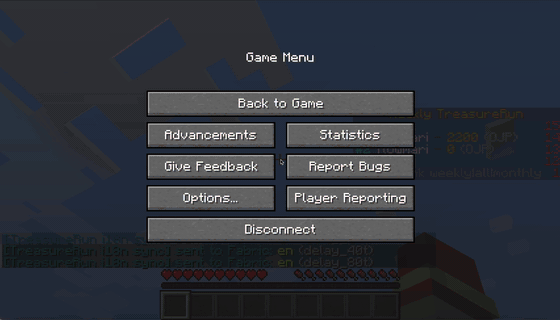

# TreasureRun — A Minecraft Treasure Hunt with Platform-Boundary i18n

TreasureRun is an open-source treasure-hunt mini-game plugin for **Minecraft Spigot 1.20.1**. Players search for treasure chests, earn points, experience staged visual and audio effects, and compete through persistent rankings.

Beyond the game itself, TreasureRun is also an i18n architecture project: Minecraft's built-in UI text is split across surfaces controlled by the server and surfaces that live on the client. TreasureRun makes that boundary explicit by separating localization responsibilities across Spigot plugin logic, packet-boundary handling, ResourcePack language assets, and an optional client-side sync layer.


## Demo

### Gameplay demo

TreasureRun running locally on Minecraft Spigot 1.20.1. This short alpha demo shows the current gameplay loop: language selection, treasure hunting, score/ranking feedback, and visual reward effects.


[High-quality 48-second gameplay demo (MP4 download)](https://raw.githubusercontent.com/flowmari/TreasureRun/main/docs/assets/treasurerun-readme-hero-demo.mp4)

### Platform-boundary i18n demo

TreasureRun also demonstrates a platform-boundary i18n approach. The existing 23-language i18n GIF is kept here so reviewers can see the technical theme directly after the gameplay demo.




## Run the Game Locally

### Requirements

- Java 17
- Docker Desktop
- Minecraft Java Edition 1.20.1

### Start an isolated local server

Set your Minecraft Java username so that the local development server can grant you permission to run game commands:

```bash
TREASURERUN_OPS=YourMinecraftName ./scripts/contributor-up.sh
```

For example:

```bash
TREASURERUN_OPS=flowmari ./scripts/contributor-up.sh
```

Then connect from Minecraft Java Edition 1.20.1:

```text
localhost:25575
```

The startup script:

1. runs the default Gradle build;
2. starts isolated MySQL 8 and Spigot 1.20.1 containers;
3. grants operator permissions to your local player;
4. installs the newly built TreasureRun plugin JAR;
5. restarts the local server with TreasureRun loaded.

Stop the local development runtime while keeping its world and database volumes:

```bash
./scripts/contributor-down.sh
```

Reset the local development runtime completely:

```bash
./scripts/contributor-down.sh --volumes
```

> This is a one-command local runtime setup. Fresh Clone QuickStart PASS evidence is documented in `docs/external/FRESH_CLONE_QUICKSTART_EVIDENCE.md`; one recorded local fresh-clone measurement completed startup successfully in 39s.

## Contributing: Start Here

For most gameplay, documentation, and translation changes, run:

```bash
./gradlew clean build
```

Docker and MySQL are **not required** for the default build.

When working on the database boundary or the ranking API, run the optional Docker-backed integration tests:

```bash
./gradlew integrationTest
./gradlew -p ranking-api integrationTest
```

These deeper tests are still part of the project. They are simply kept out of the regular contributor workflow unless they are relevant to the change.

## Good Places to Start Modifying the Project

| Goal | Start here |
| --- | --- |
| Explore gameplay flow and commands | `src/main/java/plugin/TreasureRunMultiChestPlugin.java` |
| Explore staged game effects | `src/main/java/plugin/GameStageManager.java` |
| Improve plugin-owned translations | `src/main/resources/languages/*.yml` |
| Review language selection and mapping | `src/main/resources/lang-map.yml` |
| Understand the packet-level i18n boundary | `src/main/java/plugin/LocalizedPacketMessageProtocolListener.java` |
| Work on platform-independent JSON localization | `src/main/java/plugin/i18n/PacketI18nJsonLocalizer.java` |
| Review the leaderboard read API | `ranking-api/` |

## Why TreasureRun Is Technically Interesting

Minecraft's built-in UI text is split across server-controlled and client-controlled surfaces.

TreasureRun treats that split as an architecture boundary rather than a string-replacement problem, with localization responsibilities separated across four cooperating layers:

| Layer | Responsibility |
| --- | --- |
| ProtocolLib boundary adapter | Observes and rewrites reachable server-to-client translatable packet content |
| ResourcePack language layer | Provides Minecraft standard translation-key assets |
| Fabric runtime language sync | Applies the selected client language and reloads resources without a restart |
| Pure Java packet localizer | Keeps JSON localization behavior testable without platform-specific dependencies |

The local game setup above is intended for playing with and modifying the Spigot plugin. Testing the full standard-UI i18n path additionally requires ProtocolLib, resource-pack behavior, and the optional Fabric language-sync mod.

## How the Components Fit Together

TreasureRun is **not** built as a thin Minecraft client that sends gameplay events to a separate gameplay backend.

The current architecture is:

| Component | Responsibility |
| --- | --- |
| Spigot plugin | Runs gameplay and owns ranking writes, MySQL access, Flyway migrations, and score repositories |
| `ranking-api/` | Provides a separate read-only REST API for leaderboard data through `GET /api/v1/rankings/all-time` |
| Fabric Mod | Supports optional client-side language switching and resource reload for the advanced i18n demo |

In short, the plugin owns gameplay and writes, while `ranking-api/` provides a versioned read-only view of leaderboard data.

For a more precise architectural summary:

> The Spigot plugin is the system of record for gameplay and ranking writes, including MySQL access, Flyway migrations, and score repositories. `ranking-api` exposes a separate read-only HTTP boundary over the same database through a versioned API and an OpenAPI-verified contract.

## Build and Verification

### Default build

```bash
./gradlew clean build
```

This is the regular contributor workflow. It excludes integration tests that require Docker-backed MySQL execution.

### Optional integration verification

```bash
./gradlew integrationTest
./gradlew -p ranking-api integrationTest
```

These tasks verify:

- plugin-side MySQL persistence behavior;
- Ranking API reads over real HTTP;
- Flyway-managed schema application;
- OpenAPI public contract behavior;
- disposable MySQL 8 execution through Testcontainers.

### Continuous Integration

The Ranking API integration workflow remains visible on pull requests. Docker-backed verification runs when a pull request changes the relevant backend boundary.


## Documentation

Start with:

- [`CONTRIBUTING.md`](CONTRIBUTING.md)
- [`docs/`](docs/)

The full README that existed before this contributor-focused entrance was introduced is preserved at:

- [`docs/archive/README_FULL_BEFORE_CONTRIBUTOR_ONRAMP.md`](docs/archive/README_FULL_BEFORE_CONTRIBUTOR_ONRAMP.md)

## Project Status

- Stage: alpha / portfolio open-source project
- Minecraft target: Spigot 1.20.1
- Java version: 17
- License: MIT

Fresh-clone QuickStart PASS is documented, Good first issues are open, and controlled alpha feedback collection has started. The next milestone is to respond to real alpha feedback with a small follow-up PR before broader community publication.
