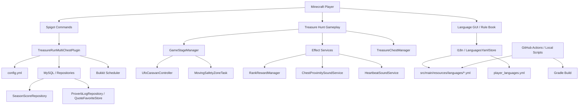

# TreasureRun Architecture

TreasureRun is a Minecraft Spigot 1.20.1 mini-game plugin built with Java 17, Gradle/ShadowJar, Docker-based runtime validation, MySQL persistence, and YAML-based 19-language i18n.

---

## System Architecture



---

## Module / Layer View

```text
TreasureRun
├── Bootstrap / Plugin Lifecycle
│   └── TreasureRunMultiChestPlugin
│
├── Command Layer
│   ├── TreasureRunStartCommand
│   ├── LangCommand
│   ├── RankDebugCommand
│   ├── StageCleanupCommand
│   ├── TreasureExportLangCommand
│   ├── CraftSpecialEmeraldCommand
│   └── CheckTreasureEmeraldCommand
│
├── Gameplay Layer
│   ├── GameStageManager
│   ├── TreasureChestManager
│   ├── TreasureItemFactory
│   ├── GameOutcome
│   └── OutcomeMessageService
│
├── Visual / Audio Effects
│   ├── MovingSafetyZoneTask
│   ├── UfoCaravanController
│   ├── RankRewardManager
│   ├── ChestProximitySoundService
│   ├── HeartbeatSoundService
│   └── StartThemePlayer
│
├── Internationalization
│   ├── I18n
│   ├── I18nHelper
│   ├── LanguagesYamlStore
│   ├── LanguageConfigStore
│   ├── LanguageSelectGui
│   ├── PlayerLanguageStore
│   └── src/main/resources/languages/*.yml
│
├── Persistence
│   ├── MySQLManager
│   ├── DBUtils
│   ├── SeasonRepository
│   ├── SeasonScoreRepository
│   ├── ProverbLogRepository
│   └── QuoteFavoriteStore
│
├── Quote / Favorites
│   ├── QuoteModule
│   ├── QuoteFavoriteCommand
│   ├── QuoteFavoritesBookBuilder
│   ├── QuoteRereadService
│   └── QuoteFavoriteShortcutListener
│
└── Quality Gates
    ├── scripts/check_i18n_yaml_syntax.py
    ├── scripts/check_i18n_required_keys.py
    ├── scripts/check_i18n_referenced_keys.py
    ├── scripts/check_i18n_duplicate_keys.py
    └── scripts/i18n_local_gates.sh
```

---

## Tech Highlights

### Concurrency / Scheduler

- Uses Bukkit scheduler tasks for time-based gameplay, countdowns, effects, and delayed demo sequences.
- Separates long-running visual/audio effects from core command handling.
- Cancels scheduled tasks during game end and cleanup to avoid stale runtime state.

### Security / Permissions

- Commands are protected through `plugin.yml` permissions.
- Debug/demo behavior is operator-only and guarded by config flags.
- Reload and cleanup commands are operator-only by default.
- Player-only commands validate sender type before accessing player state.

### Performance / Runtime Safety

- Runtime managers are reused and reloaded carefully instead of blindly recreating all state.
- Stage cleanup removes generated blocks and entities to reduce world pollution.
- Language lookup uses YAML stores and fallback chains instead of hardcoded display text.
- Effects are bounded by game state and cleanup hooks.

### Resilience / Fallback / Reload

- Language fallback chain: selected language -> English -> Japanese -> `default.unknown`.
- Missing server-side language files are seeded from bundled JAR resources.
- `/treasureReload` refreshes config, language stores, GUI state, quote module, and dependent managers.
- i18n quality gates catch YAML syntax errors, missing keys, referenced-key gaps, and duplicate keys.

---

## Runtime Flow

```text
Player runs /gamestart
        ↓
Language is resolved or language GUI opens
        ↓
GameStageManager builds the stage
        ↓
TreasureChestManager places treasure chests
        ↓
Bukkit scheduler runs countdown/effects
        ↓
Player opens chests and earns score
        ↓
Result messages, rank effects, and rewards are shown
        ↓
Score / logs are persisted
        ↓
Cleanup restores generated runtime state
```

---

## Why this architecture matters

This project demonstrates more than Minecraft gameplay. It shows maintainable Java plugin architecture, production-like configuration management, runtime validation, persistence, localization, quality gates, and safe operational commands.

Because TreasureRun is a Spigot plugin rather than a REST API service, Swagger/OpenAPI is intentionally not used. API-like behavior is represented through command documentation and architecture documentation.
