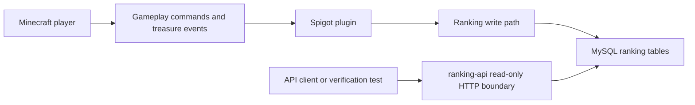

# Runtime Ranking Flow

This page gives a compact overview of the current gameplay-to-ranking boundary in TreasureRun.

It is intended for first-time readers and alpha testers who want to understand how the Spigot plugin, MySQL persistence, and the read-only Ranking API relate to each other.

## Flow

## Boundary summary

| Area | Responsibility |
| --- | --- |
| Spigot plugin | Runs gameplay, handles treasure events, and owns ranking writes |
| MySQL ranking tables | Store weekly, monthly, and all-time ranking data |
| `ranking-api/` | Exposes a separate read-only HTTP view over ranking data |
| Verification docs | Record the tested database and API boundaries |

The in-game ranking command remains part of the plugin-side gameplay path. The `ranking-api/` module is a separate read-only boundary for HTTP-based ranking inspection and verification.

## Verification pointers

- `docs/verification/ranking-persistence.md`
- `docs/verification/ranking/ranking-read-api-http-mysql-verification.md`
- `docs/verification/ranking/ranking-api-flyway-openapi-contract-verification.md`

## Non-goals

This document does not change runtime behavior.

It does not change:

- Java implementation
- database schema
- ranking API behavior
- runtime localization behavior
- language files
- ResourcePack assets
- Fabric behavior
