# Optional Playtest Features

This page contains screenshots and feature-specific checks that are useful after the core first playtest. You do not need to complete every section for your feedback to be useful.

Start with the [Player Quickstart](PLAYER_QUICKSTART.md) if you have not yet started the local server and completed the first playtest.

## Contents

- [Visual checkpoints](#visual-checkpoints)
- [Heartbeat sound check](#heartbeat-sound-check)
- [Prepared demo world](#prepared-demo-world)
- [Treasure Shop secret trade](#treasure-shop-secret-trade)
- [Ranking and MySQL check](#ranking-and-mysql-check)
- [Useful player commands](#useful-player-commands)

## Visual checkpoints

These screenshots are optional checkpoints for first-time playtesters. They are not extra setup steps. Use them to compare your screen with a known-good local playtest flow.

### Prerequisite: Minecraft 1.20.1 installation

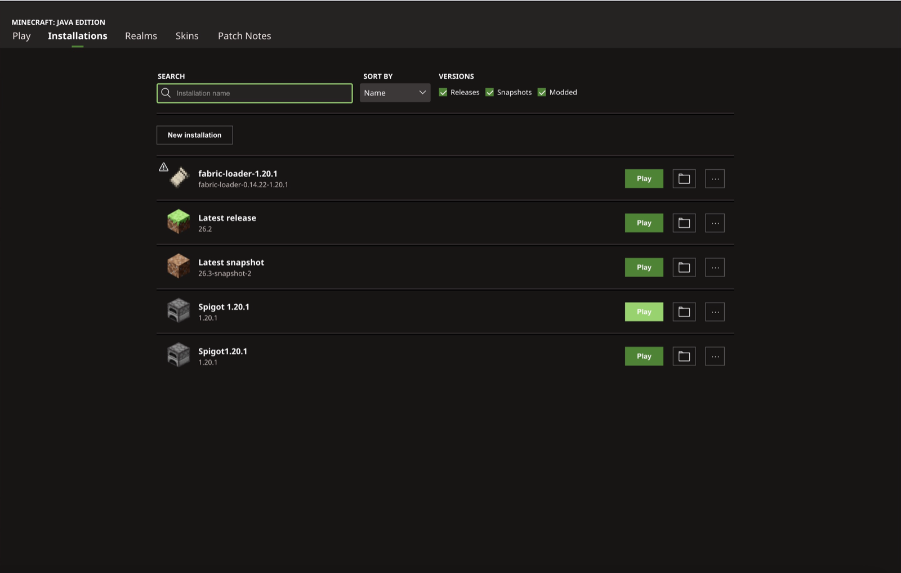

### 1. Terminal ready

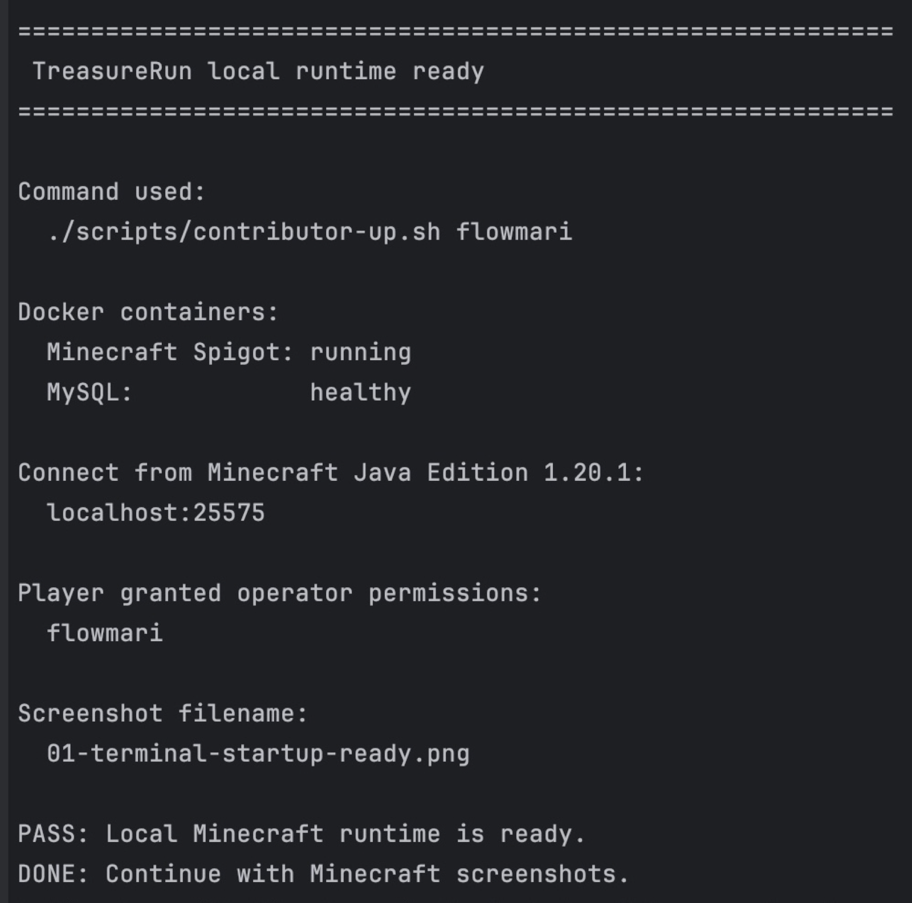

The terminal should show that the local server is ready before you join from Minecraft.

### 2. Add the local server and keep Resource Packs on Prompt

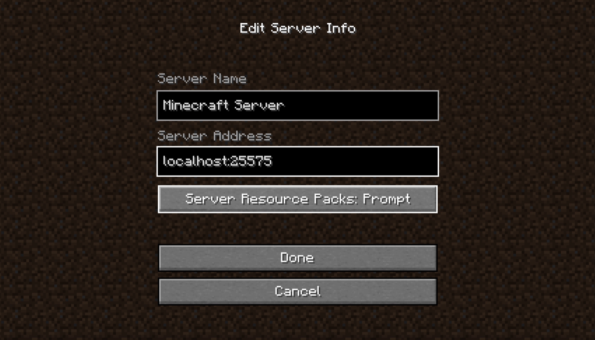

Use `localhost:25575` and keep **Server Resource Packs** set to **Prompt**.

### 3. First successful join

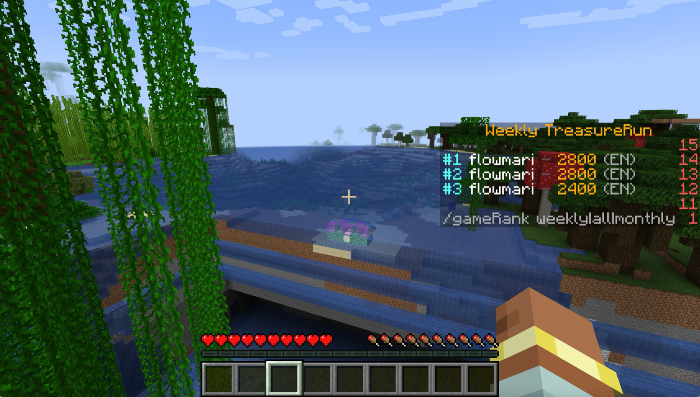

You should be able to enter the local world and see the TreasureRun overlay.

### 4. Heartbeat sound check

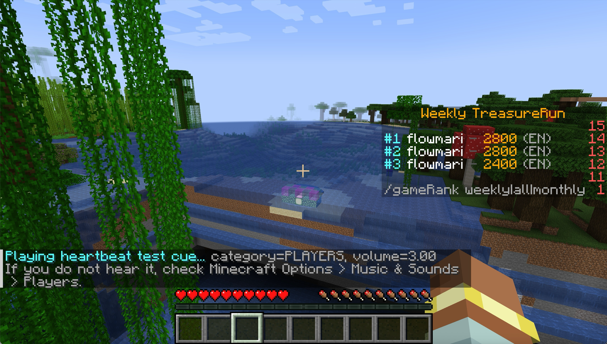

Use this only as a sound check before the run.

### 5. Set the player language to English

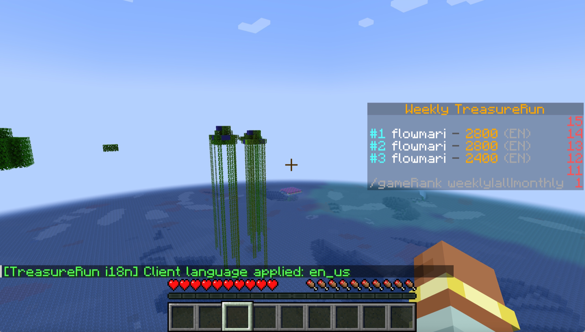

For a simple first test, use `/lang en`.

### 6. Start a Normal run

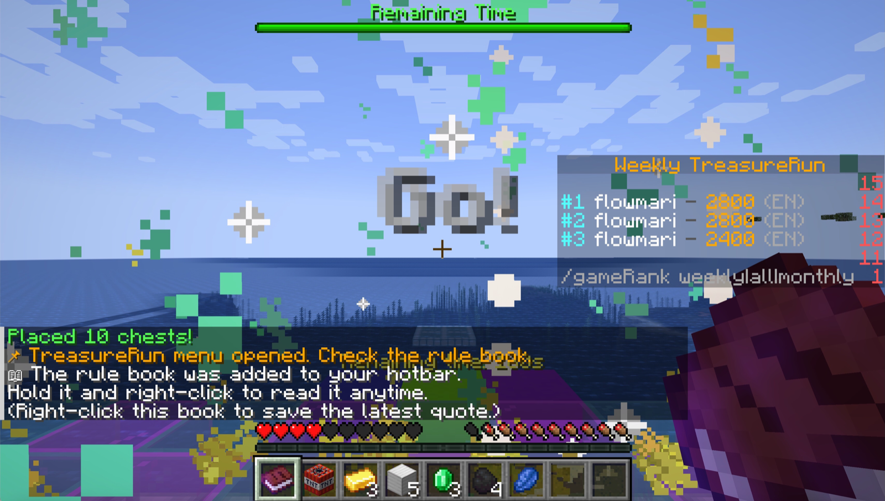

After `/gamestart normal`, the run should start and show the timer, effects, and player feedback.

### 7. Check the weekly ranking

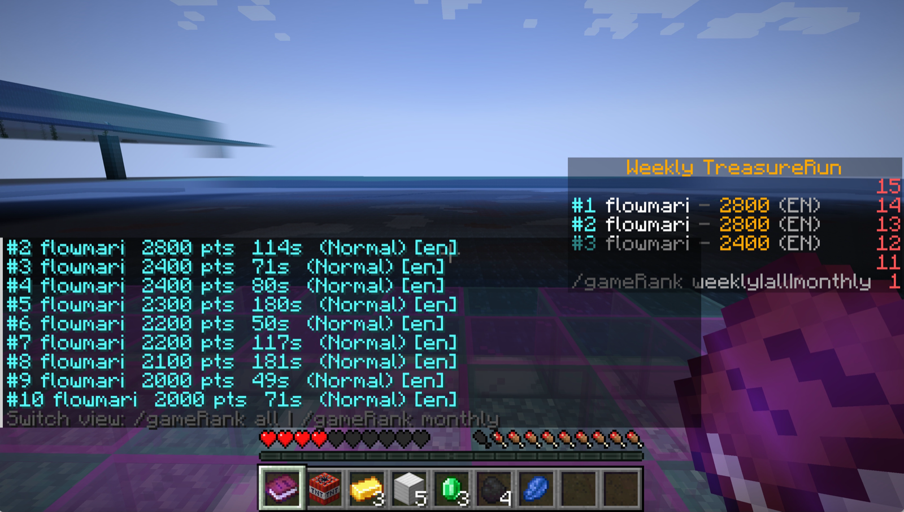

After a short test run, use `/gameRank weekly` to confirm ranking feedback appears.

### 8. Try the Treasure Shop

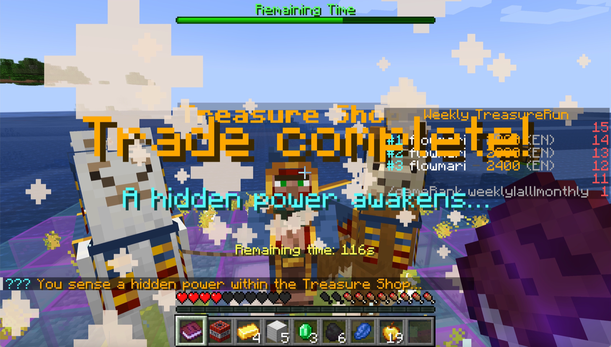

If you use the prepared demo world, the Treasure Shop interaction gives a clear visual checkpoint for the bonus trade flow.

### Optional: timeout and encouragement message examples

These examples show timeout-related feedback. A retry hint can appear after any timeout, including the first one. After three consecutive timeouts, TreasureRun displays `OVERCOMING ADVERSITY` as a supportive encouragement sequence for the player. The smaller worldbuilding quote text is selected from a pool of more than 150 randomized outcome messages, so the exact line can vary from run to run.

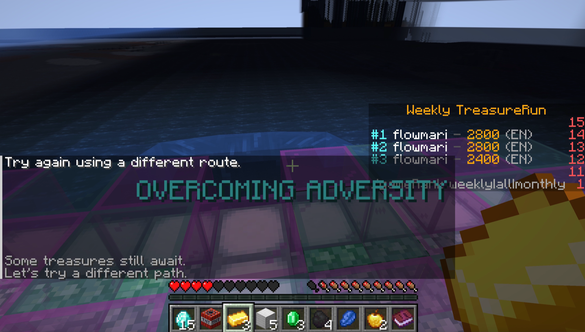

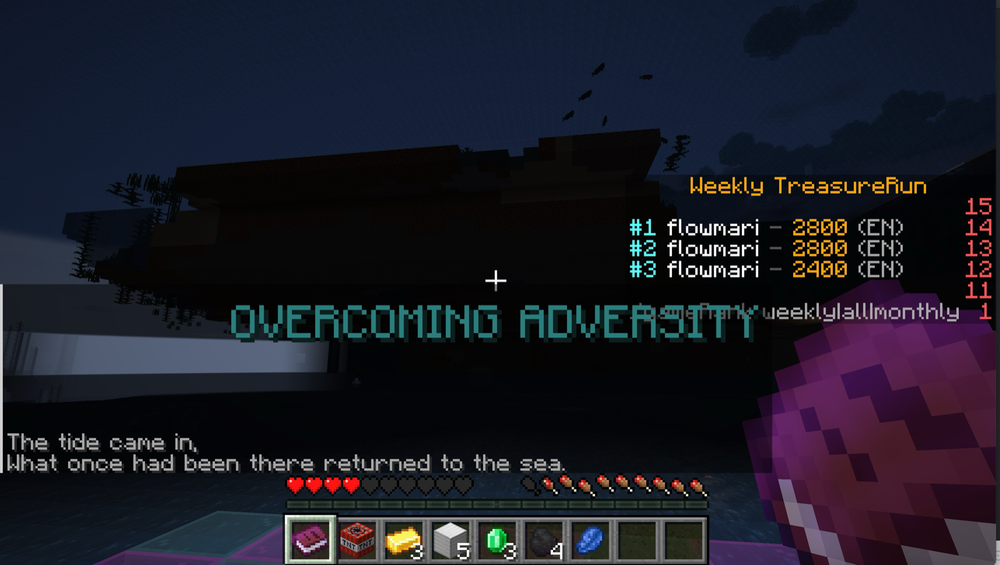

## Heartbeat sound check

Before the run, make sure Minecraft **Options > Music & Sounds > Players** is audible. If you are an operator, run:

```text
/heartbeatTest
```

You should hear a short heartbeat cue. This checks the same sound category used by the in-game heartbeat feedback.

## Prepared demo world

A freshly generated local world is enough for a basic startup and command test.

To test the same kind of staged environment shown in the README demo, use the prepared demo-world setup described in:

```text
docs/external/ALPHA_TESTER_SETUP_GUIDE.md
```

The prepared demo world includes a UFO encounter, a Treasure Shop wandering trader, two trader llamas, a moving safe zone, visual trail effects, proximity sound cues, and outcome messages.

For the tester-facing world guide, see:

```text
docs/demo-world/WHAT_TO_LOOK_FOR.md
```

## Treasure Shop secret trade

The prepared demo world includes a Treasure Shop wandering trader bonus interaction.

Watch the Treasure Shop custom-trade demo on YouTube:

https://youtu.be/eARQ0AHZNoI

The clearest secret-trade path to test is:

```text
5 Special Emeralds -> 1 Golden Apple
```

Important: test this while a run is active. If the game has already ended and you see a “Time is up” or “Game Over” message, start a new run before testing the trade.

To prepare the trade items quickly with the default demo configuration, run:

```text
/give @s diamond 15
/craftspecialemerald
/craftspecialemerald
/craftspecialemerald
/craftspecialemerald
/craftspecialemerald
```

By default, each `/craftspecialemerald` command converts 3 diamonds into 1 Special Emerald. The required diamond amount is configurable through `craftSpecialEmerald.requiredDiamonds`.

After five successful crafts, you should have 5 Special Emeralds.

Before testing the Treasure Shop interaction, hold one of the Special Emeralds in your hand and run:

```text
/checktreasureemerald
```

If the item is recognised, continue with the secret trade.

To complete the trade:

1. make sure a treasure run is active;
2. make sure you have 5 TreasureRun Special Emeralds in your inventory;
3. right-click the Treasure Shop wandering trader;
4. confirm that 5 Special Emeralds are consumed;
5. confirm that 1 Golden Apple is added to your inventory;
6. confirm that the trade triggers visible and audible feedback.

Do not manually place the Special Emeralds into the vanilla trader input slots. TreasureRun handles this secret trade directly when you interact with the Treasure Shop trader.

If the Golden Apple is not added, check these first:

- the run may have already ended;
- you may have fewer than 5 Special Emeralds;
- the item may not be recognised as a TreasureRun Special Emerald;
- your inventory may be full.

For normal playtesters, use `/craftspecialemerald`. The `/givespecialemerald` command is intended for operator/admin testing only.

## Ranking and MySQL check

The core startup command starts MySQL together with the Spigot server through Docker Compose. No separate database setup path is required for this check.

After a short treasure run, use:

```text
/gameRank weekly
```

Confirm that ranking feedback appears in chat. Deeper database and Ranking API verification remains in the build and integration-test documentation in the README.

## Useful player commands

```text
/lang en
/lang ja
/lang list
/lang current
/gamestart easy
/gamestart normal
/gamestart hard
/gameMenu
/gameRank weekly
/gameRank monthly
/gameRank all
/gameEnd
/craftspecialemerald
/checktreasureemerald
```

See the [full command reference](../COMMANDS.md).
